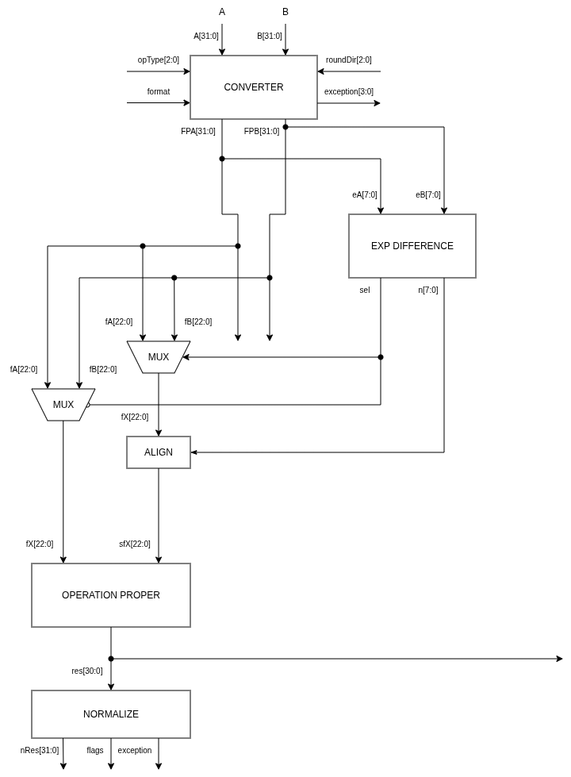

# Nano FP unit

Esta unidad está pensada para llevar a cabo operaciones en punto flotante conforme al estándar IEEE 754.

Por el momento, para el correcto funcionamiento de la unidad, se deben tener en cuenta una serie de asunciones:

- El número de entrada tiene un ancho de 32 bits.

